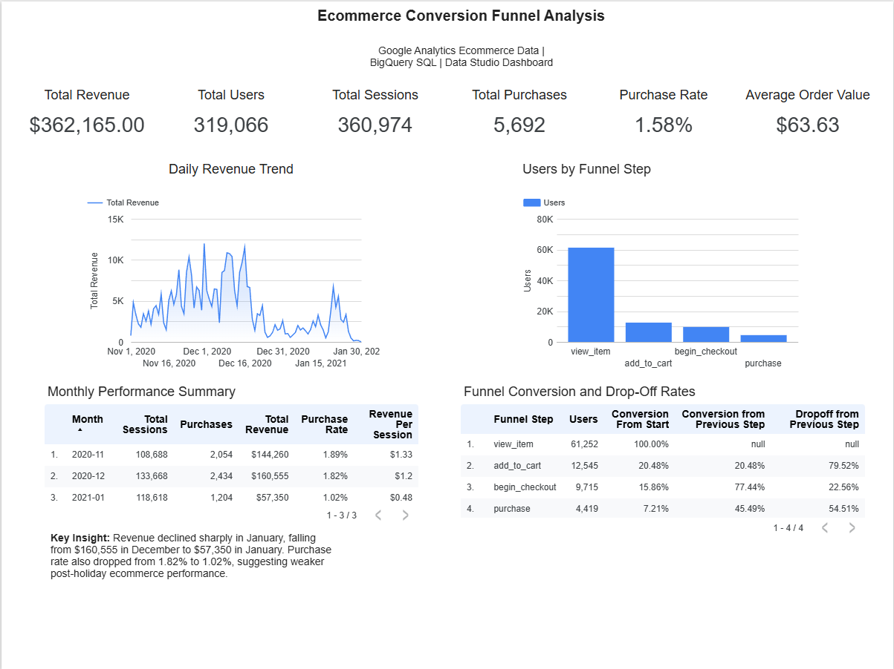

# Ecommerce Conversion Funnel Analysis Using BigQuery and Data Studio

## Project Overview

This project analyzes ecommerce user behavior from the Google Analytics public ecommerce dataset using BigQuery SQL and a Data Studio dashboard. The goal of the analysis is to understand website performance, conversion funnel drop-offs, product performance, traffic source effectiveness, and device-level purchasing behavior.

## Business Questions

* How many users, sessions, purchases, and revenue did the ecommerce site generate?
* Where are users dropping off in the conversion funnel?
* Which products generate the most revenue?
* Which high-view products have weak purchase conversion?
* Which traffic sources drive the most revenue?
* How does performance differ between desktop, mobile, and tablet users?

## Tools Used

* BigQuery
* SQL
* Data Studio
* Google Analytics public ecommerce dataset

## Dataset

The project uses the BigQuery public dataset:

`bigquery-public-data.ga4_obfuscated_sample_ecommerce.events_*`

The dataset contains Google Analytics ecommerce event data from the Google Merchandise Store.

## Dashboard Pages

### 1. Executive Overview

This page summarizes overall ecommerce performance, including total revenue, users, sessions, purchases, purchase rate, average order value, daily revenue trends, monthly performance, and funnel drop-off rates.

### 2. Product Analysis

This page analyzes top products by revenue and identifies high-view products with weak purchase conversion.

### 3. Channel & Device Analysis

This page compares traffic source performance and device-level ecommerce behavior.

## Key Findings

* Total revenue was $362,165 across 360,974 sessions.
* The overall purchase rate was 1.58%.
* The largest funnel drop-off occurred between product views and add-to-cart activity.
* Only 20.48% of users who viewed a product added one to their cart.
* Revenue declined sharply in January, falling from $160,555 in December to $57,350 in January.
* Google organic search generated the most revenue at $95,775.
* Desktop generated the most total revenue, while mobile had the highest purchase rate.
* Several high-view products had very low or zero purchase conversion, suggesting possible issues with availability, pricing, product-page quality, or checkout friction.

## Business Recommendations

1. Improve product pages with high views but low conversion by reviewing pricing, images, product descriptions, availability messaging, and call-to-action placement.
2. Investigate the January revenue decline to determine whether it was caused by seasonality, reduced promotions, lower traffic quality, product availability, or checkout issues.
3. Continue investing in organic search and direct traffic because they generated the highest revenue.
4. Optimize the mobile shopping experience because mobile users had the highest purchase rate.
5. Review high-view products with low purchase conversion for possible stock, pricing, or checkout problems.

## Repository Structure

```text
ecommerce-bigquery-funnel-analysis/
│
├── README.md
├── sql/
│   ├── 01_daily_overview_metrics.sql
│   ├── 02_conversion_funnel.sql
│   ├── 03_traffic_source_performance.sql
│   ├── 04_product_performance.sql
│   └── 05_device_and_summary_metrics.sql
│
├── dashboard/
│   └── ecommerce_conversion_funnel_dashboard.pdf
│
└── insights/
    └── business_recommendations.md
```

## SQL Files

* `01_daily_overview_metrics.sql`: Creates daily ecommerce performance metrics.
* `02_conversion_funnel.sql`: Creates funnel counts, conversion rates, and drop-off rates.
* `03_traffic_source_performance.sql`: Analyzes revenue and purchase rate by source, medium, and campaign.
* `04_product_performance.sql`: Analyzes product revenue, cart activity, purchases, and product conversion.
* `05_device_and_summary_metrics.sql`: Creates device performance, monthly summary, and overall KPI tables.

## Dashboard

View the live interactive dashboard here:

[Open Live Data Studio Dashboard](https://datastudio.google.com/reporting/a261678b-9edc-44d4-a558-9149858efb20)

View the dashboard PDF here:

[Download Dashboard PDF](dashboard/ecommerce_conversion_funnel_dashboard.pdf)

### Dashboard Preview



## Author

Aaron Navarro
